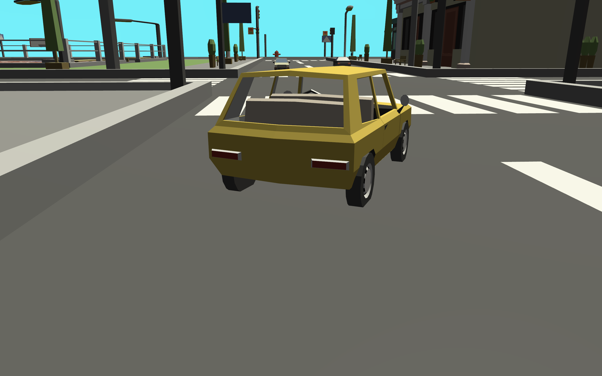
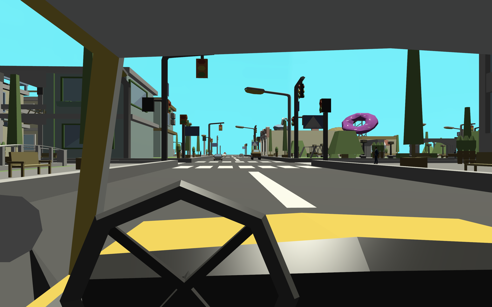
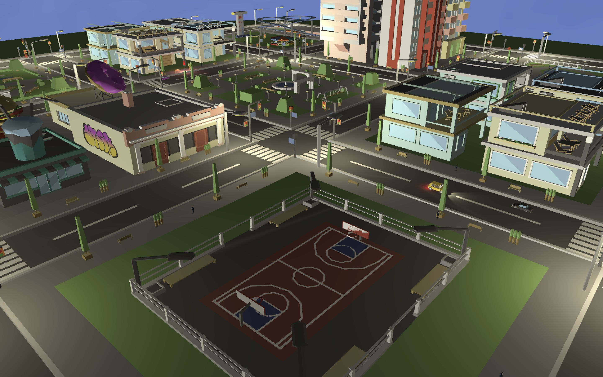
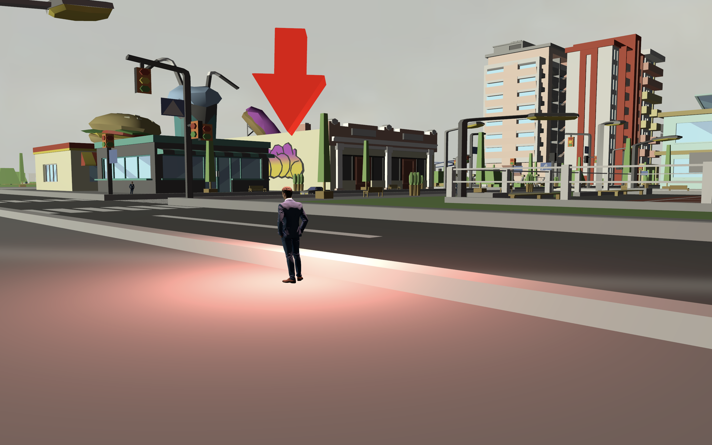
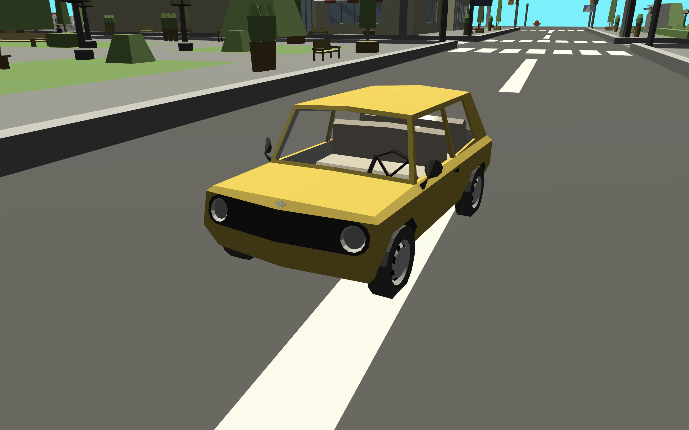
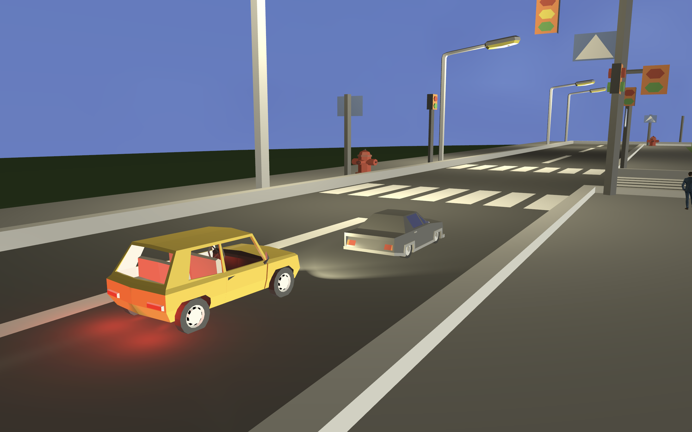

# Taxi Driver - Vulkan Game Prototype

**Real-time 3D game prototype** developed for the Computer Graphics course (Politecnico di Milano, A.Y. 2023/24).

This project highlights practical work in **C++ engineering**, **Vulkan rendering pipeline design**, and **shader programming**.

## Team

- Cotrone Mariarosaria
- De Ciechi Samuele
- Deidier Simone

## Project Overview

Taxi Driver is a compact open-city driving experience built around one complete gameplay loop: **find passenger, pick up, deliver, score, repeat**.

Core implementation highlights:

- **Real-time rendering architecture** with multiple Vulkan pipelines and descriptor set strategies.
- **Custom GLSL shader suite** (vertex + fragment), compiled to SPIR-V.
- **Dynamic day/night lighting system** integrated into gameplay readability.
- **Multi-camera gameplay design** (third person, first person, photo mode).
- **End-to-end C++ gameplay systems**: movement, collisions, scene switching, scoring, and audio events.

## Engineering Value and Design Rationale

This is not just a graphics demo. It demonstrates **practical engine-side thinking**:

- **Separating global vs local render data** for scalable shader communication.
- **Building scene-specific pipelines** rather than a one-size-fits-all path.
- **Using rendering decisions** to improve player feedback and game feel.
- **Balancing visual quality and performance** with explicit quality tiers.

## Gameplay and Design Breakdown

### Scene Flow

The application is structured around clear game states:

- Title screen
- Controls screen
- Third-person gameplay
- First-person gameplay
- Photo mode
- End-game screen

This state machine supports **onboarding, play, and closure** in a single executable.

### Core Loop

1. A passenger target is selected from predefined pickup points.
2. The player reaches the pickup location and stops in range.
3. Pickup event triggers animation and audio.
4. A dropoff target is activated.
5. Final stop completes the ride and updates score.

**Gameplay pressure and feedback**:

- **Time-based earnings** (higher reward at night).
- **Collision penalties** against NPC traffic.
- **Arcade mode** (single ride end condition).
- **Endless mode** (persistent run, cumulative score).

## Camera and Player Experience

Three camera systems are implemented and tuned for **different player intents**:

- **Third person** for spatial control and traffic awareness.
- **First person** for immersion and vehicle-scale perspective.
- **Photo mode** for free camera exploration and cinematic framing.

## Rendering and Engine Pipeline

### Vulkan Pipeline Strategy

Dedicated graphics pipelines are used for **distinct rendering contexts**:

- Taxi
- City
- NPC cars
- People
- Skybox
- Objective arrow
- 2D UI/overlay

This keeps **shader responsibilities explicit** and avoids unnecessary branching in unrelated paths.

### Descriptor Set and UBO Design

Render data is split into:

- **Global data**: camera position, sun/light configuration, game setting flags.
- **Local per-object data**: model transforms, BRDF parameters, nearest streetlight subset.

This design mirrors **production-style separation** between scene-wide and instance-specific GPU inputs.

## Shader Programming Focus

### Base Vertex Shader

- Handles object-to-clip transformations.
- Passes world-space position, UVs, and normals to fragment stage.

### Base Fragment Shader

Main lighting shader for taxi, city, NPC vehicles, and pedestrians.

**Implemented shading model**:

- Lambert diffuse + Blinn-Phong specular BRDF
- Ambient term
- Directional sun light
- Objective point light
- Taxi rear point lights
- Taxi front spot lights
- Streetlight spot lights

**Graphics quality tiers** are integrated into shader behavior:

- Low: ambient + sun + objective light
- Medium: low + taxi lights
- High: medium + streetlights

**Night-aware branching** enables additional artificial lights only when sun elevation is below horizon.

### Sky Shader

Sky color is procedurally blended from sun elevation:

- Night tone
- Sunset transition
- Day tone

Then mixed with sky texture for **stylized yet dynamic atmosphere**.

### Arrow Shader

Custom fragment shader for **objective visibility**:

- Untextured, high-contrast material
- BRDF response only to active objective light

**Goal:** maximize objective readability during navigation.

### 2D Shader Path

Simple textured shaders used for title/controls/endgame screens, integrated into the same renderer.

## Systems Engineering Highlights (C++)

- Scene and input management with key debouncing.
- NPC waypoint navigation and steering updates.
- Taxi kinematics, steering and wheel animation logic.
- Collision handling using world bounds + internal blocking boxes.
- Event-driven audio integration via miniaudio.
- Runtime descriptor mapping and per-frame uniform updates.

## Technologies

- C++17
- Vulkan
- GLSL -> SPIR-V
- GLFW
- GLM
- nlohmann/json
- miniaudio

## Build and Run

From the source folder, helper scripts are provided for shader and app compilation.

**Typical sequence**:

1. Compile GLSL shaders to SPIR-V.
2. Compile the C++ application.
3. Launch the executable.

**Note:** build scripts currently contain local environment paths and may require machine-specific adjustments.

## Visual Showcase Placeholders

Add screenshots in the following sections to complete the **portfolio presentation**.

### 1. Title Screen

*Technical note:* 2D overlay path rendered through a dedicated UI pipeline and texture-only fragment shader for clean scene-state transitions.

### 2. Controls and UX Onboarding

*Technical note:* Instruction screen uses the same 2D render route, keeping menu/ingame presentation inside one Vulkan frame workflow.

### 3. Third-Person Driving

*Technical note:* Third-person camera emphasizes spatial readability while world objects are shaded through the Base BRDF pipeline (Lambert + Blinn-Phong).

### 4. First-Person Driving

*Technical note:* First-person mode reuses the core gameplay/render stack with constrained camera rotation for immersive cockpit navigation.

### 5. Photo Mode

*Technical note:* Free camera decouples framing from taxi controls, useful for validating scene composition, lighting balance, and shader output quality.

### 6. Objective Guidance

*Technical note:* Objective readability is reinforced by a custom arrow shader plus a gameplay-linked point light driving visual focus.

### 7. Day Lighting

*Technical note:* Day setup highlights directional sun contribution and baseline ambient term across city/taxi/NPC material shading.

### 8. Night Lighting

*Technical note:* Night branch activates additional taxi and street lighting, demonstrating shader-level quality tiers and dynamic light composition.

### 9. End-Game State

*Technical note:* End-game panel is rendered in-engine via 2D textured pass, preserving a consistent pipeline from gameplay to final state.

## Credits

Course project developed within the Computer Graphics exam framework, Politecnico di Milano.
